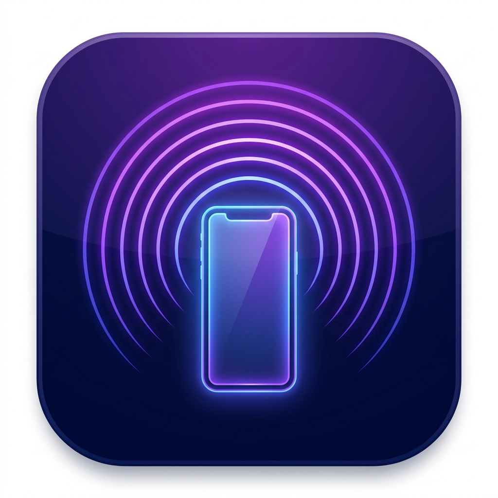

# 📱 IR Remote Pro - Pilot na Podczerwień

<div align="center">



**Uniwersalny pilot na podczerwień dla Android**

[]()
[]()
[]()

</div>

---

## ✨ Funkcje

- 📺 **60+ pilotów TV** - Samsung, LG, Sony, Panasonic, Philips, Toshiba, Sharp, Vizio, Hisense, TCL
- ❄️ **26+ pilotów AC** - Daikin, Mitsubishi, Gree, Midea, Haier, Carrier, Fujitsu i więcej
- 🎓 **Tryb uczenia IR** - Nagrywaj kody z fizycznego pilota
- 📡 **Obsługa IR Blaster** - Działa z wbudowanym nadajnikiem IR w telefonie
- 💾 **Eksport/Import** - Zapisz i przywróć nauczone kody
- ⭐ **Ulubione** - Szybki dostęp do często używanych pilotów
- 🔍 **Wyszukiwarka** - Znajdź pilota po marce lub modelu
- 📱 **PWA** - Działa offline jako aplikacja

---

## 🔧 Obsługiwane protokoły IR

| Protokół | Urządzenia |
|----------|------------|
| NEC | LG, Toshiba, Vizio, Hisense, TCL, większość TV |
| Samsung | Samsung TV |
| Sony SIRC | Sony TV |
| RC5/RC6 | Philips TV |
| Panasonic | Panasonic TV |
| Sharp | Sharp TV |
| Daikin | Daikin AC |
| Mitsubishi | Mitsubishi AC |
| LG AC | LG klimatyzatory |
| Gree | Gree, Midea AC |
| + 10 innych | Haier, Toshiba, Fujitsu, Carrier, Hitachi AC |

---

## 📲 Instalacja APK

### Metoda 1: Online (najszybsza)

1. Pobierz `dist/index.html` z tego projektu
2. Wejdź na [WebIntoApp.com](https://www.webintoapp.com/)
3. Wrzuć plik HTML
4. Pobierz gotowy APK
5. Zainstaluj na telefonie

### Metoda 2: Android Studio (pełna, z IR Blasterem)

```bash
# 1. Sklonuj projekt
git clone <repo-url>
cd ir-remote-pro

# 2. Zainstaluj zależności
npm install

# 3. Zbuduj
npm run build

# 4. Synchronizuj z Android
npx cap sync android

# 5. Otwórz w Android Studio
npx cap open android

# 6. Build → Build APK
```

Szczegóły: [BUILD_APK.md](BUILD_APK.md)

---

## 📱 Telefony z IR Blasterem

| Marka | Modele |
|-------|--------|
| **Xiaomi** | Mi 10/11, Redmi Note 8-13, POCO F3/X3 |
| **Huawei** | Mate 10-30, P20-30 |
| **Samsung** | Galaxy S6 i starsze |
| **LG** | G3, G4, G5, V20 |
| **Honor** | 8X, 9X, 20 |
| **Oppo** | Find X |

---

## 🎓 Tryb uczenia IR

1. Przejdź do sekcji "Uczenie IR"
2. Stwórz nowy profil pilota
3. Włącz tryb uczenia
4. Skieruj fizyczny pilot na telefon
5. Naciśnij przycisk - kod zostanie zapisany
6. Eksportuj kody jako JSON

---

## 🛠️ Rozwój

```bash
# Instalacja
npm install

# Tryb deweloperski
npm run dev

# Budowanie
npm run build

# Preview
npm run preview
```

---

## 📁 Struktura projektu

```
├── src/
│   ├── App.tsx              # Główna aplikacja
│   ├── components/
│   │   ├── TVRemote.tsx     # Pilot TV
│   │   ├── ACRemote.tsx     # Pilot AC
│   │   └── LearningMode.tsx # Tryb uczenia
│   ├── data/
│   │   └── irDatabase.ts    # Baza 60+ pilotów
│   └── services/
│       ├── irTransmitter.ts # Nadawanie IR
│       └── learningMode.ts  # Uczenie kodów
├── android/                  # Projekt Android
├── dist/                     # Zbudowana aplikacja
└── BUILD_APK.md             # Instrukcja budowy APK
```

---

## 📊 Statystyki bazy

- **63 piloty** w bazie
- **28 marek** urządzeń  
- **37 pilotów TV**
- **26 pilotów AC**
- **17 protokołów IR**

---

## 📄 Licencja

MIT License - używaj swobodnie!

---

## 🙏 Podziękowania

- Kody IR bazują na: LIRC, RemoteCentral, Tasmota
- Ikony: Lucide React
- UI: Tailwind CSS

---

<div align="center">

**Zbudowano z ❤️ dla społeczności smart home**

</div>
